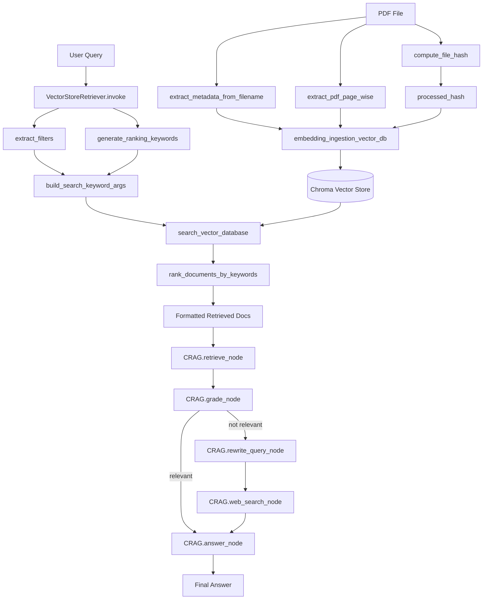

# Codebase Reusable Functions Documentation

## 1. Overview

This document catalogs the reusable classes and functions present in the Lucent RAG codebase. It focuses on actual backend logic used for ingestion, retrieval, transformation, orchestration, configuration, and shared runtime setup.

Excluded from this analysis:

- notebooks without reusable function definitions
- generated storage data under `storage/`
- debug output files under `debug_logs/`
- package-only `__init__.py` re-exports unless they clarify module interactions

## 2. Directory Scan Summary

Relevant reusable modules identified during the scan:

- `interfaces/`: abstract tool contracts for retrieval and web search
- `ingestion/`: PDF ingestion, metadata extraction, deduplication, and validation helpers
- `retriever/`: query analysis, search, reranking, and CRAG orchestration
- `utils/`: environment, LLM, embeddings, and vector-store setup helpers
- `dataset/`: Pydantic schemas for metadata and ranking keywords
- `tools/`: concrete retrieval and web search tool implementations
- `config/`: environment-backed runtime settings
- `scripts/`: notebook-facing factory helpers with reusable orchestration setup
- `src/`: thin compatibility wrapper for older schema imports

## 3. File-wise Functions and Classes

### `interfaces/tools_interface.py`

- Class `Tool`
- Method `invoke(self, **kwargs) -> str`

### `interfaces/document_retrieval_interface.py`

- Class `DocumentRetrievalTool`
- Method `invoke(self, query: str, k: int = 5, filters: dict[str, Any] | None = None) -> str`

### `interfaces/web_tool_interface.py`

- Class `WebSearchTool`
- Method `invoke(self, query: str, num_results: int = 5) -> str`

### `dataset/models.py`

- Enum `DocType`
- Enum `FiscalQuarter`
- Class `ChunkMetadata`
- Method `normalize_company_name(cls, value: Optional[str]) -> Optional[str]`
- Class `RankingKeywords`

### `ingestion/ingestion.py`

- Function `extract_metadata_from_filename(filename: str) -> dict[str, Any]`
- Function `extract_metedata_from_file_name(filename: str) -> dict[str, Any]`
- Function `extract_pdf_page_wise(pdf_path: str) -> list[str]`
- Function `pdf_to_markdown(pdf_path: str, output_md_path: str | Path) -> Path`
- Function `compute_file_hash(file_path: str, chunk_size: int = 4096) -> str`
- Function `processed_hash(vector_store) -> tuple[set[str], dict[str, Any]]`
- Function `embedding_ingestion_vector_db(vector_store, file_path: str) -> dict[str, Any]`
- Function `pick_test_pdf(data_directory: str | Path, env_var: str = "ATTACHED_PDF_PATH") -> Path`
- Function `run_pipeline_tests(vector_store, data_directory: str | Path, pdf_path: str | None = None, run_full_tests: bool = True) -> dict[str, Any]`

### `utils/common.py`

- Function `load_project_env(project_root: str | Path, env_filename: str = DEFAULT_ENV_FILENAME, override: bool = False) -> Path`
- Function `create_chat_llm(model_name: str, base_url: str = DEFAULT_BASE_URL, *, temperature: float = 0.0)`
- Function `create_embedding_model(model_name: str, base_url: str = DEFAULT_BASE_URL, *, num_ctx: int = 8192)`
- Function `create_vector_store(embedding_model, persist_directory: str | Path, collection_name: str)`

### `config/settings.py`

- Class `Settings`
- Method `__init__(self, workspace_root: Path | None = None)`
- Method `_detect_workspace_root() -> Path`
- Method `ensure_debug_dir(self) -> Path`
- Method `__repr__(self) -> str`
- Function `get_settings(workspace_root: Path | None = None) -> Settings`
- Function `reset_settings() -> None`

### `retriever/retrieval.py`

- Function `available_models(base_url: str) -> set[str]`
- Function `initialize_llm(preferred_model: str, base_url: str, fallback_base_url: str = DEFAULT_BASE_URL, probe_prompt: str = "Hello") -> tuple[object, object, str]`
- Function `has_required_signals(user_query: str) -> bool`
- Function `extract_filters(llm, user_query: str) -> dict`
- Function `generate_ranking_keywords(llm, user_query: str) -> list[str]`
- Function `build_search_keyword_args(filters: dict | None = None, ranking_keywords: Sequence[str] | None = None, k: int = 5) -> dict`
- Function `search_vector_database(vector_store, query: str, filters: dict | None = None, ranking_keywords: Sequence[str] | None = None, k: int = 3)`
- Function `extract_headings_with_content(text: str) -> list[str]`
- Function `rank_documents_by_keywords(docs, keywords, k: int = 5)`
- Function `initialize_retrieval_runtime(*, preferred_model: str, base_url: str, vector_store, fallback_base_url: str = DEFAULT_BASE_URL, probe_prompt: str = "Hello") -> dict[str, object]`

### `retriever/crag.py`

- Class `GradeDecision`
- TypedDict `CRAGState`
- Class `CRAG`
- Method `__init__(self, llm, retrieval_tool: DocumentRetrievalTool, search_tool: WebSearchTool)`
- Method `retrieve_node(self, state: CRAGState) -> dict`
- Method `grade_node(self, state: CRAGState) -> dict`
- Method `rewrite_query_node(self, state: CRAGState) -> dict`
- Method `web_search_node(self, state: CRAGState) -> dict`
- Method `answer_node(self, state: CRAGState) -> dict`
- Method `route_after_grade(self, state: CRAGState) -> str`
- Method `build_graph(self)`

### `tools/vector_store_retriever.py`

- Class `VectorStoreRetriever`
- Method `__init__(self, settings: Settings | None = None)`
- Method `_ensure_runtime(self) -> dict[str, Any]`
- Method `invoke(self, query: str, k: int = 5, filters: dict[str, Any] | None = None) -> str`
- Method `_write_debug(self, content: str, filename: str, query: str) -> None`

### `tools/web_searcher.py`

- Class `DuckDuckGoSearcher`
- Method `__init__(self, settings: Settings | None = None)`
- Method `invoke(self, query: str, num_results: int = 5) -> str`
- Method `_extract_topics(payload: dict, limit: int) -> list[tuple[str, str]]`
- Method `_write_debug(self, content: str, query: str) -> None`

### `scripts/crag_tools.py`

- Function `_setup_import_path() -> Path`
- Function `create_retriever(settings: Settings | None = None) -> VectorStoreRetriever`
- Function `create_web_searcher(settings: Settings | None = None) -> DuckDuckGoSearcher`
- Function `create_crag_agent(llm, retriever: VectorStoreRetriever | None = None, searcher: DuckDuckGoSearcher | None = None) -> CRAG`

### `src/models.py`

- Compatibility wrapper re-exporting:
- `ChunkMetadata`
- `DocType`
- `FiscalQuarter`
- `RankingKeywords`

## 4. Function Classification Table

| File | Class | Function | Category | Inputs | Outputs | Description |
|---|---|---|---|---|---|---|
| `interfaces/tools_interface.py` | `Tool` | `invoke` | Other | `**kwargs` | `str` | Abstract base method for all tool implementations. |
| `interfaces/document_retrieval_interface.py` | `DocumentRetrievalTool` | `invoke` | Retrieval | `query`, `k=5`, `filters=None` | `str` | Contract for document retrieval tools returning formatted results. |
| `interfaces/web_tool_interface.py` | `WebSearchTool` | `invoke` | Retrieval | `query`, `num_results=5` | `str` | Contract for web search tools returning formatted results. |
| `dataset/models.py` | `ChunkMetadata` | `normalize_company_name` | Transformation | `value` | `Optional[str]` | Normalizes company names to trimmed lowercase values. |
| `ingestion/ingestion.py` |  | `extract_metadata_from_filename` | Ingestion | `filename` | `dict[str, Any]` | Parses SEC-style metadata from a PDF filename. |
| `ingestion/ingestion.py` |  | `extract_metedata_from_file_name` | Ingestion | `filename` | `dict[str, Any]` | Backward-compatible alias for filename metadata extraction. |
| `ingestion/ingestion.py` |  | `extract_pdf_page_wise` | Ingestion | `pdf_path` | `list[str]` | Converts a PDF into page-level markdown chunks. |
| `ingestion/ingestion.py` |  | `pdf_to_markdown` | Transformation | `pdf_path`, `output_md_path` | `Path` | Converts a PDF into a markdown file on disk. |
| `ingestion/ingestion.py` |  | `compute_file_hash` | Utility | `file_path`, `chunk_size=4096` | `str` | Computes a deterministic SHA-256 hash for a file. |
| `ingestion/ingestion.py` |  | `processed_hash` | Utility | `vector_store` | `tuple[set[str], dict[str, Any]]` | Reads known file hashes from the vector store metadata. |
| `ingestion/ingestion.py` |  | `embedding_ingestion_vector_db` | Ingestion | `vector_store`, `file_path` | `dict[str, Any]` | Ingests PDF pages into the vector store with duplicate detection. |
| `ingestion/ingestion.py` |  | `pick_test_pdf` | Utility | `data_directory`, `env_var="ATTACHED_PDF_PATH"` | `Path` | Resolves a test PDF from an env var or a data directory. |
| `ingestion/ingestion.py` |  | `run_pipeline_tests` | Other | `vector_store`, `data_directory`, `pdf_path=None`, `run_full_tests=True` | `dict[str, Any]` | Runs ingestion validation checks and reports pass/fail status. |
| `utils/common.py` |  | `load_project_env` | Utility | `project_root`, `env_filename=".env"`, `override=False` | `Path` | Loads a project `.env` file and returns its path. |
| `utils/common.py` |  | `create_chat_llm` | Utility | `model_name`, `base_url`, `temperature=0.0` | `ChatOllama` | Creates an Ollama chat client. |
| `utils/common.py` |  | `create_embedding_model` | Utility | `model_name`, `base_url`, `num_ctx=8192` | `OllamaEmbeddings` | Creates an Ollama embeddings client. |
| `utils/common.py` |  | `create_vector_store` | Utility | `embedding_model`, `persist_directory`, `collection_name` | `Chroma` | Creates a persistent Chroma vector store. |
| `config/settings.py` | `Settings` | `__init__` | Utility | `workspace_root=None` | `None` | Loads runtime settings from environment variables and workspace paths. |
| `config/settings.py` | `Settings` | `_detect_workspace_root` | Utility | none | `Path` | Detects the workspace root from the current directory chain. |
| `config/settings.py` | `Settings` | `ensure_debug_dir` | Utility | none | `Path` | Creates and returns the debug log directory. |
| `config/settings.py` | `Settings` | `__repr__` | Utility | none | `str` | Returns a string summary of active settings. |
| `config/settings.py` |  | `get_settings` | Utility | `workspace_root=None` | `Settings` | Returns a singleton settings instance. |
| `config/settings.py` |  | `reset_settings` | Utility | none | `None` | Clears the cached global settings instance. |
| `retriever/retrieval.py` |  | `available_models` | Retrieval | `base_url` | `set[str]` | Queries Ollama for available model names. |
| `retriever/retrieval.py` |  | `initialize_llm` | Retrieval | `preferred_model`, `base_url`, `fallback_base_url`, `probe_prompt` | `tuple[object, object, str]` | Probes model and host fallbacks until a working LLM client is found. |
| `retriever/retrieval.py` |  | `has_required_signals` | Retrieval | `user_query` | `bool` | Detects whether a query contains financial or filing-related signals. |
| `retriever/retrieval.py` |  | `extract_filters` | Retrieval | `llm`, `user_query` | `dict` | Extracts structured metadata filters from a query using the LLM. |
| `retriever/retrieval.py` |  | `generate_ranking_keywords` | Retrieval | `llm`, `user_query` | `list[str]` | Generates five filing-style ranking keywords for reranking. |
| `retriever/retrieval.py` |  | `build_search_keyword_args` | Retrieval | `filters=None`, `ranking_keywords=None`, `k=5` | `dict` | Builds Chroma search kwargs from metadata and keyword constraints. |
| `retriever/retrieval.py` |  | `search_vector_database` | Retrieval | `vector_store`, `query`, `filters=None`, `ranking_keywords=None`, `k=3` | document list | Runs an MMR retrieval query against the vector store. |
| `retriever/retrieval.py` |  | `extract_headings_with_content` | Transformation | `text` | `list[str]` | Extracts markdown headings together with their following paragraph blocks. |
| `retriever/retrieval.py` |  | `rank_documents_by_keywords` | Retrieval | `docs`, `keywords`, `k=5` | document list | BM25-ranks retrieved documents using heading-aware text chunks. |
| `retriever/retrieval.py` |  | `initialize_retrieval_runtime` | Retrieval | `preferred_model`, `base_url`, `vector_store`, `fallback_base_url`, `probe_prompt` | `dict[str, object]` | Packages initialized retrieval runtime objects for downstream workflows. |
| `retriever/crag.py` | `CRAG` | `__init__` | Other | `llm`, `retrieval_tool`, `search_tool` | `None` | Injects the dependencies required for the CRAG workflow. |
| `retriever/crag.py` | `CRAG` | `retrieve_node` | Retrieval | `state` | `dict` | Retrieves documents for the latest user message. |
| `retriever/crag.py` | `CRAG` | `grade_node` | Retrieval | `state` | `dict` | Grades whether retrieved documents are sufficient to answer the question. |
| `retriever/crag.py` | `CRAG` | `rewrite_query_node` | Transformation | `state` | `dict` | Rewrites a question to improve financial retrieval quality. |
| `retriever/crag.py` | `CRAG` | `web_search_node` | Retrieval | `state` | `dict` | Falls back to web search when retrieval needs correction. |
| `retriever/crag.py` | `CRAG` | `answer_node` | Other | `state` | `dict` | Produces the final answer using only retrieved evidence. |
| `retriever/crag.py` | `CRAG` | `route_after_grade` | Other | `state` | `str` | Routes the graph toward rewrite or answer based on grading outcome. |
| `retriever/crag.py` | `CRAG` | `build_graph` | Other | none | compiled graph | Builds the LangGraph state machine for CRAG. |
| `tools/vector_store_retriever.py` | `VectorStoreRetriever` | `__init__` | Utility | `settings=None` | `None` | Stores settings and prepares lazy runtime loading. |
| `tools/vector_store_retriever.py` | `VectorStoreRetriever` | `_ensure_runtime` | Utility | none | `dict[str, Any]` | Lazily initializes retrieval dependencies, vector store, and LLM runtime. |
| `tools/vector_store_retriever.py` | `VectorStoreRetriever` | `invoke` | Retrieval | `query`, `k=5`, `filters=None` | `str` | Executes filter extraction, vector retrieval, reranking, and output formatting. |
| `tools/vector_store_retriever.py` | `VectorStoreRetriever` | `_write_debug` | Utility | `content`, `filename`, `query` | `None` | Persists retrieval debug output to a markdown file. |
| `tools/web_searcher.py` | `DuckDuckGoSearcher` | `__init__` | Utility | `settings=None` | `None` | Stores settings for the web search tool. |
| `tools/web_searcher.py` | `DuckDuckGoSearcher` | `invoke` | Retrieval | `query`, `num_results=5` | `str` | Runs a DuckDuckGo search and formats the result set. |
| `tools/web_searcher.py` | `DuckDuckGoSearcher` | `_extract_topics` | Transformation | `payload`, `limit` | `list[tuple[str, str]]` | Extracts title and snippet pairs from the API payload. |
| `tools/web_searcher.py` | `DuckDuckGoSearcher` | `_write_debug` | Utility | `content`, `query` | `None` | Writes web search output into the debug log directory. |
| `scripts/crag_tools.py` |  | `_setup_import_path` | Utility | none | `Path` | Ensures the workspace root is importable in notebook contexts. |
| `scripts/crag_tools.py` |  | `create_retriever` | Utility | `settings=None` | `VectorStoreRetriever` | Factory for a configured vector-store retriever. |
| `scripts/crag_tools.py` |  | `create_web_searcher` | Utility | `settings=None` | `DuckDuckGoSearcher` | Factory for a configured web search tool. |
| `scripts/crag_tools.py` |  | `create_crag_agent` | Other | `llm`, `retriever=None`, `searcher=None` | `CRAG` | Factory for assembling a CRAG agent with default tools. |

## 5. Dependency and Interaction Analysis

### Core module dependencies

- `dataset/models.py` provides the structured schemas used by `retriever/retrieval.py` for LLM-based metadata extraction and keyword generation.
- `utils/common.py` provides shared runtime factories for `config/settings.py`, `retriever/retrieval.py`, and `tools/vector_store_retriever.py`.
- `config/settings.py` centralizes environment-backed paths and model settings used by the concrete tool implementations in `tools/`.
- `interfaces/` defines abstract contracts consumed by `retriever/crag.py` so the CRAG workflow remains tool-agnostic.
- `retriever/retrieval.py` contains the reusable retrieval pipeline primitives used directly by `tools/vector_store_retriever.py`.
- `tools/vector_store_retriever.py` composes settings, runtime initialization, query analysis, vector search, reranking, and debug logging into a single retrieval tool.
- `tools/web_searcher.py` implements the fallback web-search tool expected by `retriever/crag.py`.
- `retriever/crag.py` orchestrates retrieval, grading, optional rewrite, web fallback, and final answering.
- `scripts/crag_tools.py` exposes notebook-friendly factories for assembling the concrete tools and the CRAG orchestrator.

### Data flow across the system

#### Ingestion flow

1. `extract_metadata_from_filename` parses filename-level SEC metadata.
2. `extract_pdf_page_wise` converts a PDF into page-separated markdown text.
3. `compute_file_hash` creates a stable file identifier.
4. `processed_hash` checks whether that file hash already exists in the vector store.
5. `embedding_ingestion_vector_db` combines metadata, page content, and file hash into `Document` objects and writes them to Chroma.

This is the main reusable ingestion pipeline in the repository.

#### Retrieval and reranking flow

1. `VectorStoreRetriever.invoke` receives the user query.
2. `_ensure_runtime` lazily creates embeddings, a Chroma vector store, and an LLM client.
3. `extract_filters` converts the query into metadata filters using `ChunkMetadata`.
4. `generate_ranking_keywords` produces filing-oriented ranking terms using `RankingKeywords`.
5. `build_search_keyword_args` converts those constraints into Chroma retriever arguments.
6. `search_vector_database` performs MMR retrieval against the vector store.
7. `rank_documents_by_keywords` reranks the retrieved documents with BM25Plus, using `extract_headings_with_content` to emphasize heading-aware sections.
8. `VectorStoreRetriever.invoke` formats the final retrieved documents into a text block and writes debug output.

#### CRAG orchestration flow

1. `CRAG.retrieve_node` calls an injected `DocumentRetrievalTool`.
2. `CRAG.grade_node` uses structured output via `GradeDecision` to determine whether the retrieved context is sufficient.
3. If insufficient, `CRAG.rewrite_query_node` rewrites the question once.
4. `CRAG.web_search_node` calls the injected `WebSearchTool` as fallback context generation.
5. `CRAG.answer_node` generates the final answer using only the available evidence.
6. `CRAG.build_graph` wires this logic into a LangGraph state machine.

This separation is meaningful: orchestration is isolated in `retriever/crag.py`, while concrete retrieval and search implementations live in `tools/`.

## 6. Reusable Pipelines Summary

- PDF ingestion pipeline: filename metadata extraction, PDF page conversion, deduplication via file hashing, and vector-store writes.
- Retrieval pipeline: query signal detection, metadata extraction, ranking keyword generation, Chroma MMR retrieval, heading-aware BM25 reranking, and formatted output generation.
- CRAG pipeline: retrieve, grade, optionally rewrite, optionally web-search, then answer from evidence.
- Runtime setup pipeline: load settings, create Ollama clients, create Chroma vector store, and expose notebook-friendly factories for assembly.

## 7. Flow Diagram



## 8. Directory Tree

```text
lucent/
├── config/
│   ├── Modelfile.txt
│   └── settings.py
├── dataset/
│   ├── __init__.py
│   └── models.py
├── docs/
│   ├── codebase_reusable_functions.md
│   └── directory_file_placement_guide.md
├── ingestion/
│   └── ingestion.py
├── interfaces/
│   ├── __init__.py
│   ├── document_retrieval_interface.py
│   ├── tools_interface.py
│   └── web_tool_interface.py
├── retriever/
│   ├── __init__.py
│   ├── crag.py
│   └── retrieval.py
├── scripts/
│   └── crag_tools.py
├── src/
│   └── models.py
├── tools/
│   ├── tools.py
│   ├── vector_store_retriever.py
│   └── web_searcher.py
└── utils/
    ├── __init__.py
    └── common.py
```
